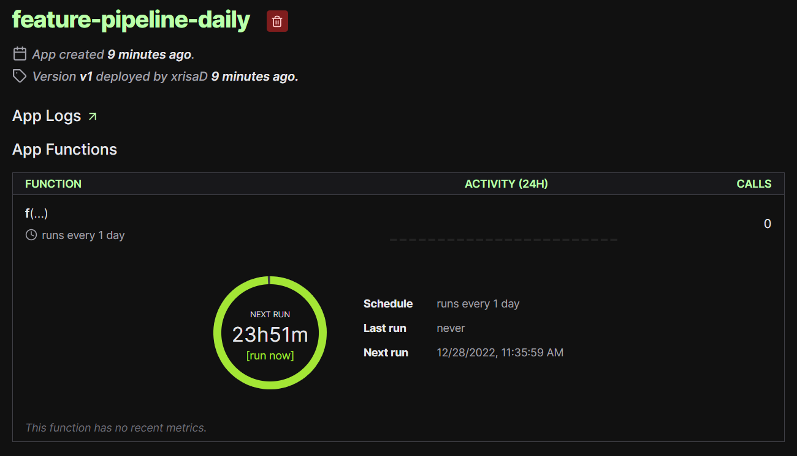

# Real-time Streamflow Predictions
This service provides Streamflow predictions based on the weather for 3 locations in Sweden: Abisko, Spånga and Uppsala.
It consists of a Feature Pipeline and a Training Pipeline which runs on Modal as Serverless Functions. The Training Pipeline performs Parallel Hyperparameter tuning for XGBoost. A Batch Inference pipeline has also been implemented to predict and create diagrams. Moreover, our service provides a UI with a map with the future predictions as well as a monitor UI. 

## Members 
* Olivia Höft 
* Chrysoula Dikonimaki
## APIs & Data
The APIs used are the following:
1. Hydrological Observations (https://opendata-download-hydroobs.smhi.se/api) from The Swedish Meteorological and Hydrological Institute (SMHI) to get the Streamflow Data.
2. Weather Open API (https://open-meteo.com/en/docs) from Open-Meteo for the Weather Data. The parameters used are the following: temperature_2m_max, temperature_2m_min, precipitation_sum, rain_sum,snowfall_sum, precipitation_hours, windspeed_10m_max, windgusts_10m_max, winddirection_10m_dominant, et0_fao_evapotranspiration.

## Steps
1. Finding open APIs. Finding free data that combines historical data and future predictions was challenging. Especially for the weather, many datasets were evaluated.
2. Data exploration and the decision of how to use the data.
3. Get historical data and store them in Feature Groups in Hopsworks.
4. Create a Feature Pipeline to get data daily and store them in the Feature Groups.
5. Deploy the Feature Pipeline in Modal.
6. Create training pipelines to get the new data from Hopsworks as a Feature View, train a model and save it in the Model Registry in Hopsworks.
7. Create a batch inference pipeline to predict the streamflow daily, save the predictions in a Feature Group in Hopsworks and create images for the monitor app.
8. A UI was implemented to show a map with the locations and the predictions for these locations the following 7 days.
9. A monitor UI was implemented to show graphs and tables for both historical and future predictions.

## The Training Pipelines
Two training pipelines were developed. 
1. `training-pipeline.py`: This pipeline trains a Gradient Boost Regressor on the training set and save it.
2. `training-pipeline-2.py`: This pipeline performs Parallel Hyperparameter Tuning on an XGBoost Regressor. 
This has been done by running a separate serverless function for each set of hyperparameters.
Then the set of hyperparameters that gives us the best score in the test data is used to train the XGBoost Regressor on the whole dataset.
2. `training-pipeline-3.py`: XGBoost performed better when we were doing experiments offline, so it was selected and deployed to Modal as a serverless function to run every 7 days on the new data that was generated the latest 7 days.

## Bonus
1. Multipe Models were tried: Gradient Boost Regressor and XGBoost Regressor.
2. Parallel Hyperparameter Tuning: Parallel Hyperparameter Tuning is used to decide on the hyperparameters of XGBoost
3. Multiple days forecast: The Recursive Multi-step Forecast technique is used to predict the streamflow for the next 6 days.
4. Training Pipeline that is retrained every 7 days on the latest data 
5. Tests using pytest: We have refactor the code into functions and tested them using pytest tests.
6. Batch Inference Pipeline
7. Monitor UI: A monitor UI was implemented to monitor the predictions. The UI provides predictions for historical data for the last days and future predictions.
8. Diagrams for a better user experience

## Screenshots & Description

### The UI
The UI is deployed in HuggingFace: https://huggingface.co/spaces/Chrysoula/StreamflowPredictions.
It is developed using a Python framework called Streamlit.

### The Monitor UI
The Monitor UI is deployed in HuggingFace: https://huggingface.co/spaces/Chrysoula/StreamflowMonitor.
It is developed using a Python framework called Gradio.

### The Feature Pipeline 
The feature pipeline that runs on Modal every day as a serverless function.

### The Training Pipeline
The training pipeline that runs on Modal every 7 days as a serverless function and uses multiple serverless function to perform Hyperparameter tuning.

Parallel Hyperparameter tuning on Modal: 

### The Batch Inference Pipeline 
The Batch Inference Pipeline that runs on Modal every day.

### The Feature Groups

### The Feature View

### The Models

